## Task 1
*Проверка наличия, запуленного через UI, образа nginx, его run и чек процесса через ps* 
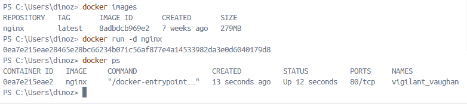

**docker inspect 0ea7e215eae2**
- *Размер контейнера:*

- *Замапленые порты:*
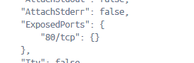
- *IP контейнера:*

*Stop контейнера по присвоенному ID и подтверждение остановки через ps*
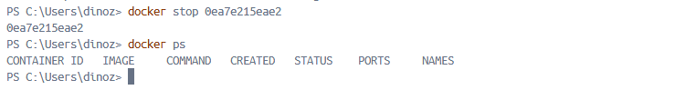

*Запуск контейнера с маппингом на порты 80 и 443, рестарт и проверка рестарта*
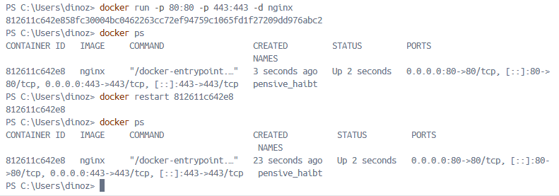

*Проверка доступа стартовой страницы nginx по адресу localhost:80*
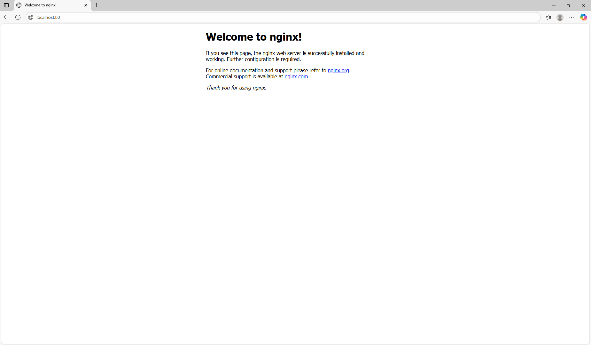
## Task 2

*Просмотр исходного файла nginx.conf*
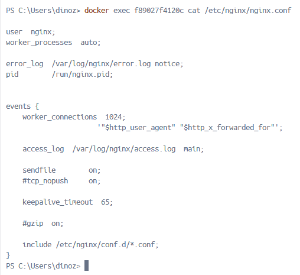

*Создание кастомного nginx.conf* 
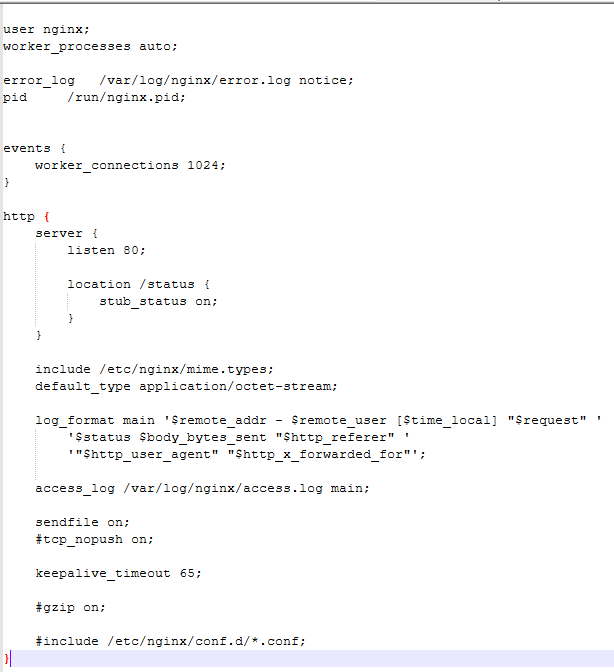

*Копирование nginx.conf в контейнер, перезагрузка контейнера и экспорт контейнера (в последствие экспорт был перепроизведён через docker export \[id] -o container.tar и остановлен)*
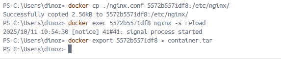

*Проверка доступности страницы по адресу localhost:80/status*
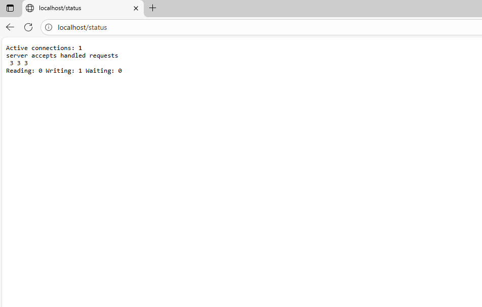

*Удаление образа nginx и следом контейнера*
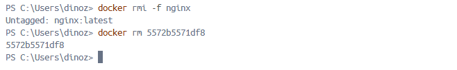

*Импорт контейнера*

*Запуск контейнера*

*Повторная проверка страницы по адресу localhost:80/status*
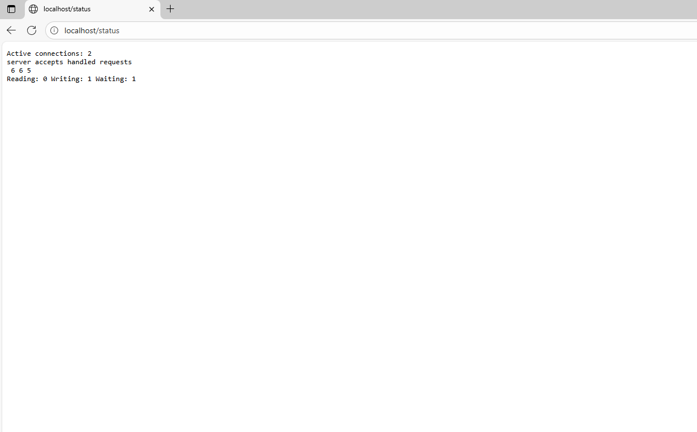